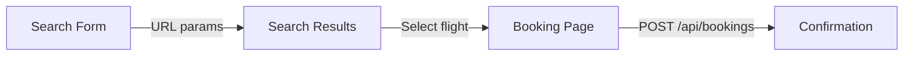

# Architecture

This document explains the architectural decisions behind SkyBook and the trade-offs considered.

## Overview

SkyBook is a client-heavy Next.js application with mock API routes. The user journey spans three main areas:

```
Home (search form) → Search Results → Booking → Confirmation
```



## Layered Structure

Responsibilities are separated into distinct layers:

| Layer | Location | Responsibility |
|-------|----------|----------------|
| **Pages** | `src/app/` | Route definitions, layout composition |
| **Components** | `src/components/` | Presentational and container UI |
| **Hooks** | `src/hooks/` | Reusable stateful logic |
| **Store** | `src/store/` | Cross-page client state |
| **API Client** | `src/lib/api/` | HTTP calls to mock API |
| **Domain Logic** | `src/lib/utils/` | Pure functions (filter, sort, format) |
| **Validation** | `src/lib/validation/` | Zod schemas shared by client and API |
| **Data** | `src/lib/data/` + `data/flights.json` + `scripts/generate-flights.mjs` | Server-side data access; all airport pairs generated |
| **API Routes** | `src/app/api/` | Mock backend endpoints |

This keeps UI components thin and pushes business logic into testable pure functions.

## State Management

Three categories of state, each handled differently:

### 1. Server State — TanStack Query

Flight search results are fetched from `/api/flights`. React Query handles:
- Loading and error states
- Caching (60s stale time)
- Automatic retry (2 attempts)
- Refetch on demand (error retry button)

Query key: `["flights", { origin, destination, date, passengers }]`

**Why React Query?** Flight data is inherently server-owned. React Query is the standard tool for async server state and eliminates boilerplate for loading/error/caching.

### 2. URL State — Next.js Search Params

Search criteria (origin, destination, date, passengers) live in the URL:

```
/search?origin=JFK&destination=LAX&date=2026-07-15&passengers=2
```

**Why URL state?** Search params are shareable, bookmarkable, and survive page refresh. They represent the "source of truth" for what the user searched.

**Trade-off:** Filter and sort state are kept in component state (not URL) to avoid over-engineering for this scope. In production, I'd promote these to URL params as well.

### 3. Client State — Zustand

The booking flow uses a lightweight Zustand store for:
- `searchParams` — cached for back-navigation
- `selectedFlight` — the flight being booked
- `confirmation` — persisted booking result (localStorage via `persist` middleware)

**Why Zustand?** The booking flow spans multiple pages and needs to survive navigation without prop drilling. Zustand is minimal (~1KB), requires no providers beyond the store itself, and the `persist` middleware keeps confirmation accessible after refresh.

**Alternative considered:** React Context — rejected because it causes unnecessary re-renders and doesn't persist across sessions without extra work.

## Data Flow

### Search Flow

```
SearchForm (validate with Zod)
  → router.push(/search?params)
  → SearchResults reads URL params
  → useFlightSearch (React Query) → GET /api/flights
  → useFlightResults (client filter/sort)
  → FlightCard list
```

Filtering and sorting happen **client-side** after fetch. Results are **paginated** (default 10 per page) to keep the UI performant and scannable with 30+ flights. At scale (10k+ results), I'd move filtering/sorting/pagination to the API with cursor-based pagination.

### Booking Flow

```
FlightCard → selectFlight (Zustand) → /booking?flightId=…
  → useFlightById (fallback if store empty, e.g. refresh)
  → FlightReview + BookingForm
  → POST /api/bookings (validate server-side with same Zod schema)
  → setConfirmation (Zustand) → /booking/confirmation
```

Validation runs on both client (immediate feedback) and server (security). The same Zod schema is imported in both places to avoid drift.

## Mock API Design

API routes in `src/app/api/` simulate a real backend:

- **Latency:** 600–800ms delay to exercise loading states
- **Errors:** Opt-in via `?simulateError=true` query param
- **Validation:** Server-side Zod validation on booking POST
- **Data access:** `flights-repository.ts` reads from `data/flights.json` with in-memory caching

This structure mirrors how a real integration would work — swap the repository implementation without changing the API contract or frontend.

## Component Design

Components follow a **feature-based** organization:

```
components/
├── ui/          # Generic, reusable (Button, Input, Select, Badge)
├── search/      # Search-specific (SearchForm, FlightCard, FiltersPanel)
├── booking/     # Booking-specific (FlightReview, BookingForm)
├── shared/      # Cross-feature (LoadingState, EmptyState, ErrorState)
└── layout/      # App shell (AppHeader)
```

UI primitives (`Button`, `Input`) are kept generic and composable. Feature components compose these primitives and accept data via props — no direct API calls in presentational components.

## Error Handling Strategy

| Scenario | Handling |
|----------|----------|
| API fetch failure | `ErrorState` with retry button (React Query refetch) |
| No results for route | `EmptyState` with contextual message |
| Filters exclude all | `EmptyState` with "Clear filters" action |
| Form validation | Inline field errors from Zod |
| Booking API failure | Error message above submit button |
| Missing flight on booking page | Fetch via `GET /api/flights?id=`; show error or empty state if 404 |

## Testing Strategy

Tests focus on **high-value, deterministic logic**:

| Area | Type | Rationale |
|------|------|-----------|
| `flight-utils.ts` | Unit | Core business logic — filter, sort, format |
| `schemas.ts` | Unit | Validation rules and URL param parsing |
| `flights-repository.ts` | Unit | Mock data integrity (30+ flights per route) |
| `SearchResults` | Component | Loading, empty, error states |
| `SearchForm` | Component | Search validation UX |
| `FlightCard` | Component | Key result display |
| `BookingForm` | Component | Validation UX |
| Shared states | Component | LoadingState, EmptyState, ErrorState |

**Not tested (yet):** Full E2E flows. Next priority would be Playwright for search → book → confirm.

## Scalability Considerations

| Concern | Current Approach | At Scale |
|---------|-----------------|----------|
| Result set size | Client-side filter/sort (~36 flights) | Server-side with pagination |
| API caching | React Query 60s stale time | CDN + longer cache for static routes |
| State persistence | Zustand + localStorage | Server session or URL-only |
| Bundle size | No code splitting beyond Next.js defaults | Route-based splitting, lazy filters panel |
| Type safety | Manual types + Zod | OpenAPI-generated types from real API |

## Accessibility

Current implementation includes:
- Semantic HTML (`article`, `section`, `dl`, `label`)
- ARIA attributes on form errors (`role="alert"`, `aria-invalid`)
- Loading states with `role="status"` and `aria-live="polite"`
- Focus rings on interactive elements

Further work: keyboard navigation for sort/filter controls, skip links, and automated a11y testing with axe-core.

## Key Trade-offs

1. **Client-side vs server-side filtering** — Chose client-side for simplicity and instant UX with small datasets. Documented migration path for scale.

2. **Zustand vs URL-only booking state** — Selected flight is stored in Zustand (persisted) with API fallback via `useFlightById` on refresh.

3. **Mock API vs static import** — Chose API routes to demonstrate realistic async patterns, loading states, and a clean swap path to a real backend.

4. **No component library** — Built minimal UI primitives to show intentional design choices without fighting a library's opinions. In production, I'd evaluate Radix/shadcn for accessibility primitives.

5. **Scope discipline** — Deliberately omitted: round-trip search, seat selection, payment, auth, multi-passenger forms. These are documented as next steps rather than half-built features.
